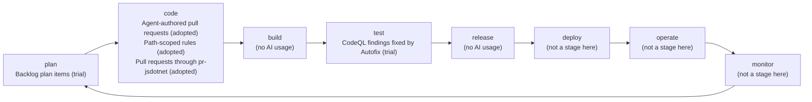

# AI Adoption Map

```meta
status: trial
type: adoption-map
```

How this repository develops with AI, placed on the DevOps loop. Its flow has five
positions: work is planned as Backlog plan items, coded by agent sessions that open pull
requests, built and tested by `pr-check.yml`, and released to NuGet by `publish-nuget.yml`.
The servers ship as NuGet packages that other repositories install, so this repository has
no `deploy`, `operate` or `monitor` stage of its own.

## Usage files

| File | Stage | Covers |
|---|---|---|
| `01-plan.md` | `plan` | Turning a goal into ordered, pasteable work items |
| `02-code.md` | `code` | Agent sessions that author changes and open pull requests |
| `03-build.md` | `build` | `pr-check.yml` and the build jobs of `publish-nuget.yml` |
| `04-test.md` | `test` | Unit tests, the coverage gate and the CodeQL scan in `pr-check.yml` |
| `05-release.md` | `release` | `publish-nuget.yml`: versioning, packing and pushing to NuGet |

## Loop



## Empty stages

- `build` and `release` are stages of this flow with no AI usage: both are plain GitHub
  Actions jobs.
- `deploy`, `operate` and `monitor` are empty because the flow does not have them — nothing
  is deployed or run from here. Kept on the loop, not dropped: the emptiness is the finding.

## Reading and extending

`status` rates each usage on the ladder in `devbook-ai.md` — `candidate`, `trial`, `adopted`,
`hold`, `retired` — and `date` is the day that rating was set. Add a chapter to the usage
file for its stage and update this file's table and diagram in the same change.
