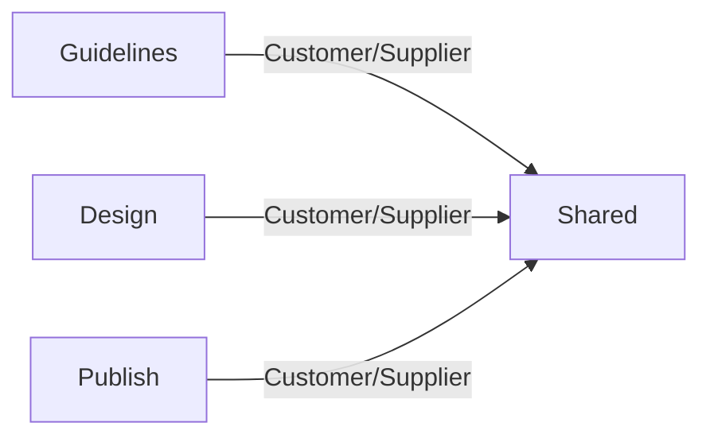

# Project Guidelines MCP

```meta
status: draft
type: context-map
related: [.devbook/arc42/01-introduction-and-goals.md]
```

The contexts below are listed from the repository's layout and have no folder of their own
yet. A context gets one — with `context.md` and the files `devbook-domain.md` lists — when its
model is first written down.

## Subdomain landscape

| Subdomain | Classification | Bounded context |
|---|---|---|
| Coding guidance | Core | Guidelines (`src/JSdotNet.MCP.Guidelines`, content in `guide/`) |
| UX guidance | Core | Design (`src/JSdotNet.MCP.Design`, content in `design/`) |
| Result publishing | Supporting | Publish (`src/JSdotNet.MCP.Publish`) |
| Document retrieval | Generic | Shared (`src/JSdotNet.MCP.Shared`) |

## Context map



All three servers reference Shared, the upstream supplier of the document catalogs, the guide
tools and the usage log.

## Published languages

The MCP tool surface each server exposes is the published language agents consume: the guide
tools (`search_guides`, `list_guides`, `get_guide` and their siblings) for Guidelines and
Design, and the result tools (`publish_result`, `read_published` and their siblings) for
Publish.

## Strategic rules

- A server serves guidance and never decides for its caller.
- Every response carries the ids of the source documents it came from.
