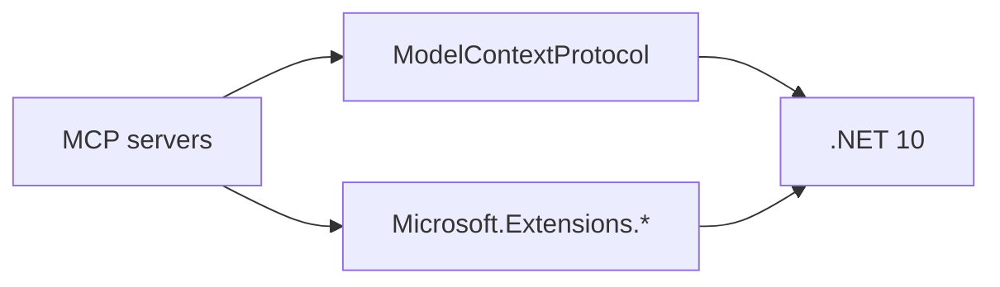

# Technology Graph

```meta
status: candidate
related: [.devbook/arc42/01-introduction-and-goals.md]
```

The stack this repository builds on: .NET 10 MCP servers over the `ModelContextProtocol`
package, versions managed centrally in `Directory.Packages.props`, built and published to
NuGet by GitHub Actions.

## Layers

| Layer file | Covers |
|---|---|
| `shared.md` | The runtime and packages every server uses: .NET, `ModelContextProtocol`, `Microsoft.Extensions.*` |
| `server.md` | What only one server needs |
| `tooling.md` | Build, test, coverage, CI/CD and the AI tooling the development flow runs on |

No layer file exists yet. `devbook:tech-update` fills them from the package inventory under
`.devbook/_tools/devbook-tech/`; register a new layer in this table in the same change.

## Graph



Nodes become chapters in the layer files, and edges become their `depends-on`; keep the two
in step.

## Reading the ratings

Every technology chapter carries a `status` on the ladder in `devbook-tech.md`: `candidate`,
`trial`, `adopted`, `hold`, `retired`.
